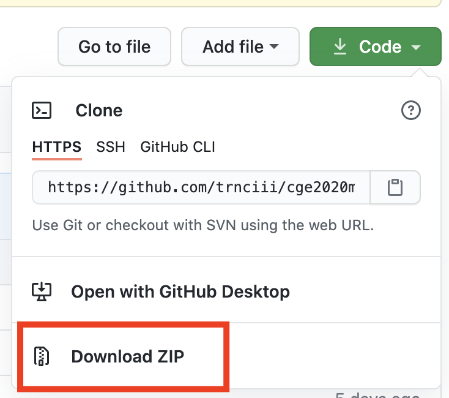
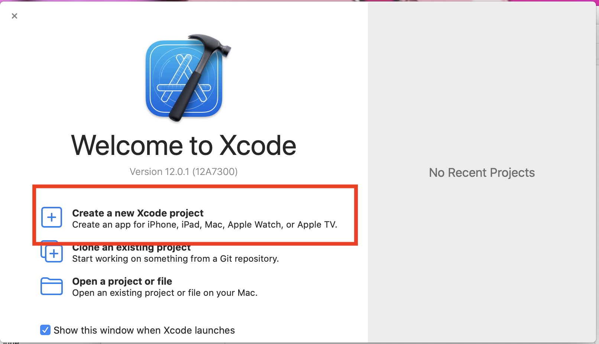
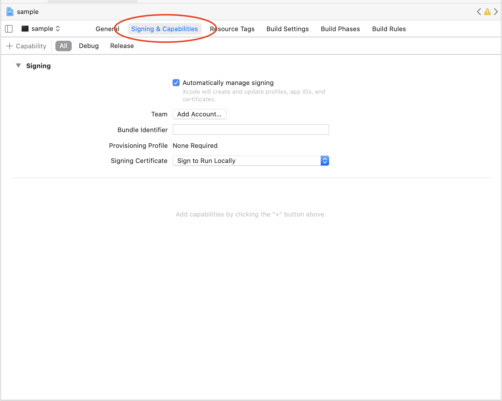
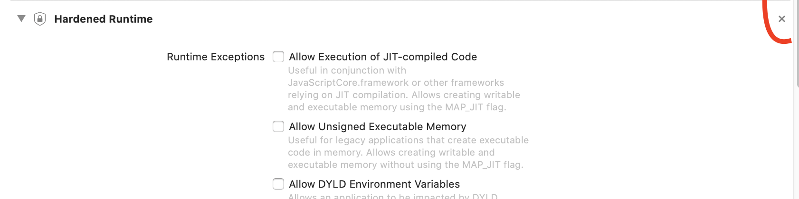

以下のサイトを参考にして、黒いウィンドウを出すとこまでやります。適宜参照してください。
[https://qiita.com/souring001/items/64881ff1383a15271b5b](https://qiita.com/souring001/items/64881ff1383a15271b5b)

完成したプロジェクトファイルを[こちら](https://github.com/trnciii/ciesample-setup)に置いてるので、最悪zipでダウンロードしてプログラムを実行できることを確認してください。

# 各種インストール
## xcode
App store で探してインストールしてください  

## brew
homebrew を使って授業で使うライブラリをインストールします。<br>
まだ入れてない方は、ターミナルから下のコードでいれましょう。[https://brew.sh/](https://brew.sh/)
```commandline
/bin/bash -c "$(curl -fsSL https://raw.githubusercontent.com/Homebrew/install/master/install.sh)"
```

## GLFW
ターミナルで以下のコードをいれます
```commandline
brew install glfw
```
---

# プロジェクトの作成
インストールしたライブラリの動作確認のため、最も簡単なプログラムを書いてみます。
ここから下は参考サイトをみたほうがはやいという人もいると思います。
また面倒な人は、[ここ](https://github.com/trnciii/ciesample-setup)からプロジェクトをダウンロードして`sample.xcodeproj`を開き、実行できるか確認するだけでもいいです。<br>



自分でやってみたい人は、まず xcode で新しいプロジェクトを作成します<br>
<br>
↓<br>


## ライブラリ追加
* Build phases -> Link Binary with Libraries から ``OpenGL.framework`` を選択
* 同じリストに ``/usr/local/Cellar/glfw/3.3/lib`` にある　``libglfw.3.3.dylib``　をドロップして追加


## ヘッダ追加
Build settings -> Header Search Path の項目に`/usr/local/Cellar/glfw/3.3.2/include`を追加.<br>リストの右側をrecursive に設定<br>


## コードを書いてウィンドウを出す  
main.cpp に以下のソースをコピペしてビルドします (左上の再生ボタン)<br>
[https://www.glfw.org/documentation.html](https://www.glfw.org/documentation.html)<br>

```cpp
#include <GLFW/glfw3.h>

int main(void)
{
    GLFWwindow* window;

    /* Initialize the library */
    if (!glfwInit())
        return -1;

    /* Create a windowed mode window and its OpenGL context */
    window = glfwCreateWindow(640, 480, "Hello World", NULL, NULL);
    if (!window)
    {
        glfwTerminate();
        return -1;
    }

    /* Make the window's context current */
    glfwMakeContextCurrent(window);

    /* Loop until the user closes the window */
    while (!glfwWindowShouldClose(window))
    {
        /* Render here */
        glClear(GL_COLOR_BUFFER_BIT);

        /* Swap front and back buffers */
        glfwSwapBuffers(window);

        /* Poll for and process events */
        glfwPollEvents();
    }

    glfwTerminate();
    return 0;
}
```
いろいろ警告が出るかもしれませんが、しばらく待ってこのような "Hello World" という真っ黒いウィンドウが出ればOKです。<br><br>


# FAQ

### Q. GLFW/glfw3.h file not found とエラーが出る
A. フォルダが実在するか確認, バージョンの数字などは自分の環境にあわせる

### Q. コンパイルできるが、実行すると "abort with payload" とでる
A. macの権限まわりが原因でこういうことが起きるようです。
Xcodeの設定で *signing/capabilities* のところに *Hardened Runtime* という項目があったら、削除したのち実行してみてください。

* 権限がきつくない状態



* もしこの項目があれば\[x\]を押して削除

